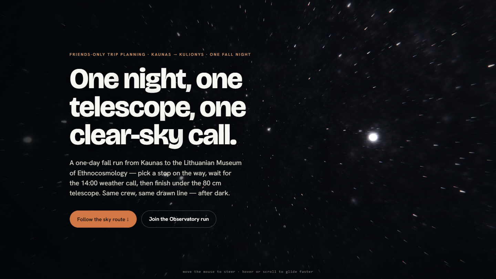

# Observatory Warp Hero — Handoff

**Status:** chosen prototype, speed locked, ready for the next agent to integrate + polish.
**Date:** 2026-06-03
**Site:** "Where To, Crew?" — Observatory trip ("Orbit To The Telescope").

---

## What this is

A full-screen cosmic **warp / hyperspace drift** hero: a slow, meditative glide through a deep
star field, graded warm→cool (the warm road-trip glow cooling into night), with the trip headline
held on a protected left scrim. It is the candidate the user picked after 3 rounds of iteration.

- **Single self-contained file:** `index.html` (inline CSS + JS, no build step).
- **Resting speed is LOCKED at `0.07×`** (the value the user dialed in). See *Tuning* below.

## Base effect & licensing  ⚠️ read before any public/commercial deploy

- **Effect:** "Star Nest" volumetric fractal star field by **Pablo Roman Andrioli (Kali)** —
  Shadertoy **XlfGRj**. The raymarch math/constants are reproduced faithfully; the grading,
  composition, post-processing, motion and choreography are bespoke for this site.
- **License:** Shadertoy default is **CC BY-NC-SA 3.0** (non-commercial, attribution, share-alike).
  This is fine for a friends-only / non-commercial site. **If this ever goes commercial, get the
  author's permission or replace the density field with an independently-licensed one.** Keep the
  attribution comment in `index.html`.
- Libraries: **Three.js 0.160** (MIT), **GSAP 3.13** (standard no-charge license), Google Fonts
  Bricolage Grotesque + Hanken Grotesk (OFL).

## Stack (matches the live site)

- Three.js 0.160 via ESM **importmap** (CDN) + GSAP 3.13 via CDN. The live site already uses GSAP
  3.13 + Lenis; Three.js is the only addition and it's additive (no rewrite).
- No build, no framework. Drop-in compatible with the existing static HTML/CSS/JS site.

## How it works

1. **Warp field** — a full-screen `ShaderMaterial` quad (orthographic camera) raymarches the Star
   Nest fractal. `uTravel` advances the camera forward; `uVel` scales speed; `uSteer` (mouse)
   rotates the field; `uWarm` blends the warm→cool grade.
2. **Streak pass** — radial zoom-blur + chromatic aberration toward a steerable vanishing point
   (the felt "speed"); near-zero at rest, grows only with velocity.
3. **Bloom** — restrained `UnrealBloomPass` (strength 0.18 + vel·0.36) so bright cores glow without white-out.
4. **Reveal choreography** — GSAP: a gentle launch settles over ~4s into the calm `0.07×` drift while
   the grade cools warm→night; headline eyebrow → word-stagger → sub → buttons.
5. **Interaction** — mouse steers; hover/scroll temporarily speeds the drift, then it eases back to calm.

## Tuning knobs (all in `index.html`)

| Want to change | Where |
|---|---|
| **Resting speed** | `const speedScale = 0.07;` (1.0 = base drift). Lower = slower. |
| Base drift / boost curve | `const fwd = (0.015 + vel * 0.50) * speedScale;` in the loop |
| Warm↔cool grade | `uWarm` / the `intro.warm` tween (1 = warm, 0 = cool night) |
| Bloom intensity | `bloom.strength = 0.18 + vel * 0.36;` |
| Vignette darkness | `.vignette` radial-gradient opacity (currently strong/cinematic — ease if too dark) |
| Density / depth of the field | Star Nest `#define`s (volsteps, tile, darkmatter, distfading) |
| Headline / copy / CTAs | `.hero` markup (copy + palette already match the site) |

## Integration notes for the next agent

- **Where it goes:** the Observatory default home hero. It is the natural terminus of the existing
  dawn→night scroll "environment" — the warm launch → cool night drift mirrors that journey.
- **Reuse, don't duplicate:** the site already loads GSAP/Lenis and has design tokens
  (`--terra`, `--forest`, `--paper`, Bricolage/Hanken). This file uses matching values inline;
  on integration, swap to the site's real CSS vars and motion conductor (`assets/motion.js`,
  `assets/sky.js`) rather than shipping a second animation system.
- **Wire real CTAs / nav** (currently `href="#"` placeholders).

## Known gaps / TODO (intentionally left for integration + polish)

- **Reduced-motion fallback:** NOT yet implemented. The site brief requires a `prefers-reduced-motion`
  path — add a static star-field frame / poster image when reduced motion is set.
- **Local assets:** currently CDN (Three/GSAP/fonts). The site's "local assets only at publish"
  policy means these should be vendored locally before a public deploy.
- **Mobile / touch:** steering is pointer-based; verify behavior on touch (no hover) and confirm
  performance — it's a per-pixel raymarch (DPR capped 1.5, 12 volume steps; light, but test on real
  phones). Consider a lower DPR or a static fallback on small/low-power devices.
- **Performance:** runs smoothly on desktop Intel integrated graphics in testing; confirm on target hardware.

## Provenance / where the alternatives live

This was chosen from a multi-round exploration in `travel/hero-lab/`:
- `gallery.html` — switch between all candidates live.
- `candidates/` — black hole (Interstellar-style, also strong), nebula flythrough, Hubble-photo dive,
  observatory-eyepiece framings, and the warp variants. See `PLAN.md` for the full process + rationale.
- The runner-up worth knowing about: `candidates/r2-blackhole/` (lensed black hole) — kept as a
  possible alternative / secondary scene.
